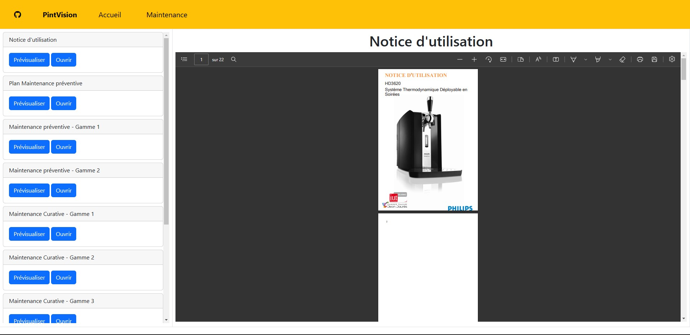
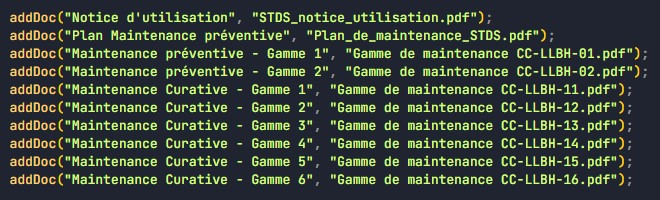

= Dossier d’Analyse et de Conception
:toc:
:toc-title: Sommaire

Date : 17/01/2023 +
Client : Rémi Boulle +
Projet : Création d'une application web permettant de visualiser des données d'une tireuse à bière améliorée par l'ajout de capteurs + 

<<<

== 1. Description du Projet
=== a) Equipe

Étudiant.e.s +
- https://github.com/Fiujy[KERROUCHE Mohamed] : Développeur +
- https://github.com/GalateeM[MARCQ Galatée] : SCRUM Master +
- https://github.com/LeilaMartinet[MARTINET Leila] : Product Owner +
- https://github.com/caerroff[MASIN Thomas] : Développeur +
- https://github.com/hugomonte[MONTE Hugo] : Développeur

Professeur.e.s +
- https://github.com/rboulle[Rémi Boulle] +
- https://github.com/ependaries[Esther Pendaries]

=== b) Contexte du projet

La SAE 3.01 est une SAE inter-départements, réalisée en collaboration entre les étudiants de seconde année de BUT Génie Industriel et Maintenance et nous-mêmes, étudiants en deuxième années de BUT Informatique. Ces derniers ayant amélioré une tireuse à bière en lui intégrant des capteurs, ils ont besoin que nous leur développions une application permettant d’exploiter graphiquement les données ainsi récupérées, afin de gérer l’état et les pannes éventuelles de la machine.

=== c) Objectifs du projet
Use Case général : +
image:UC/usecase_general.svg[width=35%,height=35%]

L'objectif de ce projet est la création d'un application web, de la documentation technique, utilisateur et un cahier de tests. +
Grâce à l'application, l'utilisateur doit pouvoir consulter les données de la tireuse en temps réel, mais également à l'historique des données sur une période donnée. L'application permettra également de consulter les pannes en cours, de pouvoir consulter la documentation pour dépanner la tireuse, et de recevoir des notifications concernant ses pannes soit par mail soit en notification push s'il s'y est abonné.

== 2. Déploiement du projet en local

Prérequis : +
- Installation de Docker sur votre ordinateur

=== a) Utilisation du docker

*Note d'usage :* nous utiliserons `docker compose` dans les exemples ci-dessous, mais dans les anciennes versions de Docker, il s'agit de `docker-compose` (un tiret au lieu de l'espace).

Ouvrir une invite de commande (cmd dans le menu démarrer). Se placer dans le dossier "Code" du projet, en utilisant la commande `cd <chemin>`. +
Une fois dans le bon répertoire, taper `docker compose up` (`docker compose up -d` si vous voulez détacher votre terminal du lancement), cela lancera les services.

La première fois que vous lancerez cette commande, cela prendra plus de temps, car il téléchargera les images. Les fois suivantes, cela sera bien plus rapide !

Pour arrêter les services, taper simplement `docker compose down` (à ne pas faire si vous voulez suivre les étapes suivantes).

=== b) Comment accéder aux services ?

Ayant lancé les services Docker, vous pouvez désormais accéder à Node-RED en tapant "localhost:8080" dans le navigateur de votre choix. +

Pour accéder au site en lui-même, il faut vous rendre sur `localhost:3000`, rien de plus n'est nécessaire, vous serez immédiatement en lien avec les services, s'ils ont été correctement installés précédemment.

== 3. Fonctionnalités

Avant d'entrer en détail dans les fonctionnalités disponibles, voici un schéma de l'ensemble de nos services et leur fonctionnement entre eux.

image:Images/vue_globale.jpg[width=50%,height=50%]

=== a) Historique des données

Use case : En tant qu'utilisateur je souhaite pouvoir consulter l'historique des données de la tireuse sur une période donnée. +
image:UC/usecase_historique.svg[]

- Connexion et insertion de données dans TimeScaleDB

Pour cette fonctionnalité, le code est présent dans la classe `server.js`. +
Nous avons utilisé le langage NodeJS pour créer la connexion à la base de données TimeScaleDB. Pour cela, nous avons utilisé le module `sequelize` qui permet également la création de tables, l'insertion et la récupération des données. La création des tables se fait avec un `sequelize.define` (si les tables ont déjà été créées, cela ne fait rien et donc l'historique ne sera pas perdu):

image:Images/création_tables.png[width=50%,height=50%]

Pour l'insertion des données en temps réel, l'utilisation de `sequelize.sync().then(()=>{})` permet de synchroniser toutes les tables avant insertion, et ainsi de s'assurer qu'elles ont bien été créées au préalable. Cette fonction est présente dans la fonction `client.on("message", (topic, payload)`, elle est donc appelée à chaque fois qu'un flux MQTT est reçu. Un `switch` est utilisé afin de séparer chaque type de donnée, car chaque type est présent dans une table différente. Ensuite, les données sont insérées avec un `create` :

image:Images/insertion_données.png[width=50%,height=50%]

=== b) Visualisation des données 

La page principale permet d'obtenir les différentes données. Nous considérons 2 types, les données en temps réel, et l'historique. Pour ce qui est des données en temps réel, elles sont retransmises par le serveur Node.js avec lequel le client ouvre une connexion WebSocket (via le module `socket.io`). Le serveur Node.js étant connecté en direct avec le flux MQTT, à la réception d'une donnée, elle est automatiquement redirigée à tous les clients connectés en WebSocket (via le module `socket.io` également). En plus de la retransmission en direct, les données sont enregistrées dans la base de donnéées afin d'en construire l'historique par la suite.

Serveur

image:Images/mqtt_connection.png[width=75%,height=75%]

image:Images/websocket_redirect.png[width=50%,height=50%]

Client

image:Images/open_ws_from_client.png[width=75%,height=75%]

image:Images/example_websocket.png[width=75%,height=75%]

Lorsqu'on arrive sur le site, on retrouve différentes sections. 

A gauche : Différentes cases permettant de retrouver les valeurs concernant la Température, la Quantité du fût, la Puissance et la consommation en CO2. 

Sur le reste de la page, des informations supplémentaires en fonction du type de données qu'on a sélectionné sur les cases à gauche (par défaut, sur Température). 

On retrouve en haut un historique sous forme de graphique. 

En dessous, l'état de l'apparareil, il permet d'afficher les problèmes / pannes en cours comme "Température élevée de la bière !". 

Sur le bas de la page, un affichage plus spécifique des informations mises à dispositions, avec un système de jauge dynamique ou logo évoluant en fonction de l'état de la donnée. 

On retrouve enfin sur la droite, un historique des pannes en cours, celles mesurées par le MQTT. 

=== c) Page de maintenance

La page maintenance permet d'accéder à la documentation en cas de besoin.

Sur celle-ci, on retrouve sur la partie gauche une barre latérale, avec la liste des documents disponibles en PDF. On y retrouve 2 options, "Prévisualiser" et "Ouvrir". La prévisualisation remplace le document actuel sur la partie principale de la page et le titre juste au-dessus de celle-ci par le nom du document choisi. L'ouverture permet d'afficher dans un nouvel onglet le fichier PDF en lui-même, par la suite l'utilisateur peut faire le choix de le télécharger ou non par exemple.

Cette partie est aisément modulable, à l'aide de fonctions. En effet, à l'aide d'une simple ligne (comme ci-dessous), on ajoute un élément à la barre latérale qui sera directement prévisualisable et ouvrable.

