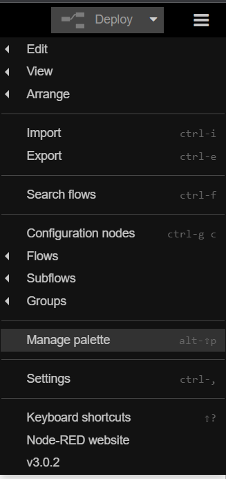
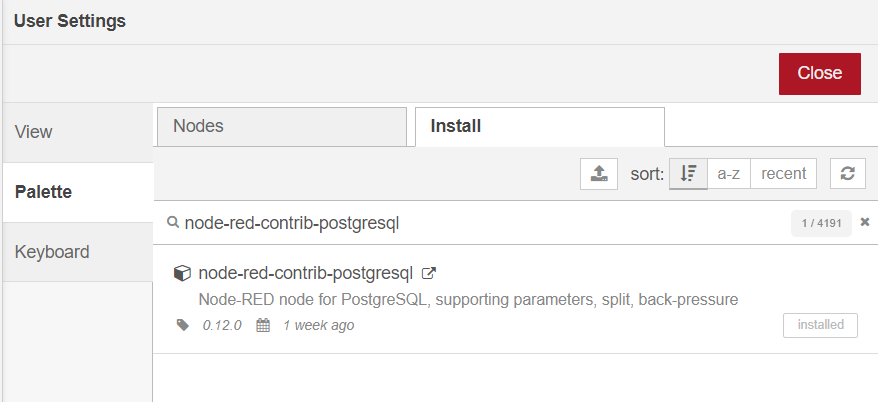
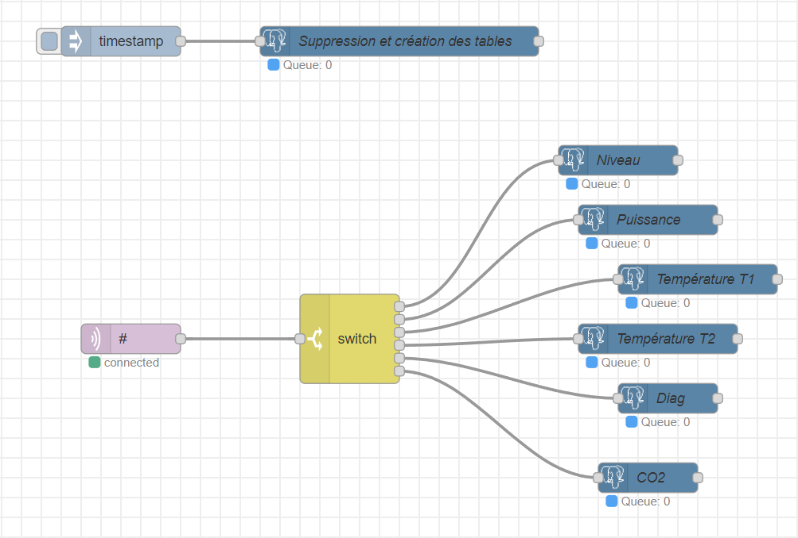

= Dossier d’Analyse et de Conception
:toc:
:toc-title: Sommaire

Date : 17/01/2023 +
Client : Rémi Boulle +
Projet : Création d'une application web permettant de visualiser des données d'une tireuse à bière améliorée par l'ajout de capteurs + 

<<<

== 1. Description du Projet
=== a) Equipe

Étudiant.e.s +
- https://github.com/Fiujy[KERROUCHE Mohamed] : Développeur +
- https://github.com/GalateeM[MARCQ Galatée] : SCRUM Master +
- https://github.com/LeilaMartinet[MARTINET Leila] : Product Owner +
- https://github.com/caerroff[MASIN Thomas] : Développeur +
- https://github.com/hugomonte[MONTE Hugo] : Développeur

Professeur.e.s +
- https://github.com/rboulle[Rémi Boulle] +
- https://github.com/ependaries[Esther Pendaries]

=== b) Contexte du projet

La SAE 3.01 est une SAE inter-départements, réalisée en collaboration entre les étudiants de seconde année de BUT Génie Industriel et Maintenance et nous-mêmes, étudiants en deuxième années de BUT Informatique. Ces derniers ayant amélioré une tireuse à bière en lui intégrant des capteurs, ils ont besoin que nous leur développions une application permettant d’exploiter graphiquement les données ainsi récupérées, afin de gérer l’état et les pannes éventuelles de la machine.

=== c) Objectifs du projet

== 2. Déploiement du projet en local

Prérequis : +
- Installation de Docker sur votre ordinateur

=== a) Utilisation du docker

Ouvrir une invite de commande (cmd dans le menu démarrer). Se placer dans le dossier "Code" du projet, en utilisant la commande `cd <chemin>`. +
Taper ensuite la commande `docker run -d -p 80:80 docker/getting-started`, puis `docker-compose up`.

Vous pouvez désormais accéder à Node-RED en tapant "localhost:8080" dans le navigateur de votre choix. Ajoutez la palette postgresql. Pour cela, allez dans le menu, puis `Manage Palette`. +
 +
Dans l'onglet `Install`, recherchez `node-red-contrib-postgresql` et installez cette palette. +
 +

Afin d'accéder à l'historique des données, vous devez importer le fichier https://github.com/GalateeM/SAE-ALT-S3-Dev-22-23-STDS-3B-Equipe-5/blob/main/Code/node_RED_configuration.json[node_RED_configuration.json] en allant dans le menu, puis en cliquant sur `Import`.

== 3. Fonctionnalités

=== a) Historique des données

Use case : En tant qu'utilisateur je souhaite pouvoir consulter l'historique des données de la tireuse sur une période donnée

- Récupération et insertion des données dans TimeScaleDB

Nous avons utilisé Node-RED afin de récupérer le flux MQTT provenant du serveur Raspberry Pi. Pour cela, nous avons ajouté une node `mqtt in`. Nous avons ajouté une connexion à TimescaleDB, et avec des requêtes SQL créé des tables pour stocker chaque donnée. La node `split` permet de trier les données en fonction de leur type (température, CO2, niveau,...), pour ensuite insérer les données dans la table correspondante.

