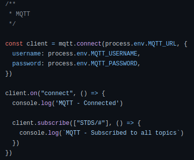
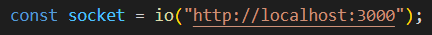
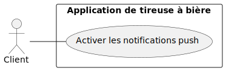

= Dossier d’Analyse et de Conception
:toc:
:toc-title: Sommaire

Date : 17/01/2023 +
Client : Rémi Boulle +
Projet : Création d'une application web permettant de visualiser des données d'une tireuse à bière améliorée par l'ajout de capteurs + 

<<<

== 1. Description du Projet
=== a) Equipe

Étudiant.e.s +
- https://github.com/Fiujy[KERROUCHE Mohamed] : Développeur +
- https://github.com/GalateeM[MARCQ Galatée] : SCRUM Master +
- https://github.com/LeilaMartinet[MARTINET Leila] : Product Owner +
- https://github.com/caerroff[MASIN Thomas] : Développeur +
- https://github.com/hugomonte[MONTE Hugo] : Développeur

Professeur.e.s +
- https://github.com/rboulle[Rémi Boulle] +
- https://github.com/ependaries[Esther Pendaries]

=== b) Contexte du projet

La SAE 3.01 est une SAE inter-départements, réalisée en collaboration entre les étudiants de seconde année de BUT Génie Industriel et Maintenance et nous-mêmes, étudiants en deuxième années de BUT Informatique. Ces derniers ayant amélioré une tireuse à bière en lui intégrant des capteurs, ils ont besoin que nous leur développions une application permettant d’exploiter graphiquement les données ainsi récupérées, afin de gérer l’état et les pannes éventuelles de la machine.

=== c) Objectifs du projet
Use Case général : +
image:UC/usecase_general.svg[width=35%,height=35%]

L'objectif de ce projet est la création d'un application web, de la documentation technique, utilisateur et un cahier de tests. +
Grâce à l'application, l'utilisateur doit pouvoir consulter les données de la tireuse en temps réel, mais également à l'historique des données sur une période donnée. L'application permettra également de consulter les pannes en cours, de pouvoir consulter la documentation pour dépanner la tireuse, et de recevoir des notifications concernant ses pannes soit par mail soit en notification push s'il s'y est abonné.

== 2. Déploiement du projet en local

Prérequis : +
- Installation de Docker sur votre ordinateur

=== a) Utilisation du docker

*Note d'usage :* nous utiliserons `docker compose` dans les exemples ci-dessous, mais dans les anciennes versions de Docker, il s'agit de `docker-compose` (un tiret au lieu de l'espace).

Ouvrir une invite de commande (cmd dans le menu démarrer). Se placer dans le dossier "Code" du projet, en utilisant la commande `cd <chemin>`. +
Une fois dans le bon répertoire, taper `docker compose up` (`docker compose up -d` si vous voulez détacher votre terminal du lancement), cela lancera les services.

La première fois que vous lancerez cette commande, cela prendra plus de temps, car il téléchargera les images. Les fois suivantes, cela sera bien plus rapide !

Pour arrêter les services, taper simplement `docker compose down` (à ne pas faire si vous voulez suivre les étapes suivantes).

=== b) Comment accéder aux services ?

Ayant lancé les services Docker, vous pouvez désormais accéder à Node-RED en tapant "localhost:8080" dans le navigateur de votre choix. +

Pour accéder au site en lui-même, il faut vous rendre sur `localhost:3000`, rien de plus n'est nécessaire, vous serez immédiatement en lien avec les services, s'ils ont été correctement installés précédemment.

== 3. Fonctionnalités

Avant d'entrer en détail dans les fonctionnalités disponibles, voici un schéma de l'ensemble de nos services et leur fonctionnement entre eux.

image:Images/vue_globale.jpg[width=50%,height=50%]

=== b) Visualisation des données en temps réel

Use case : 	En tant qu’utilisateur je souhaite consulter les données de la tireuse en temps réel. +

- Récupérer les données sous forme de flux MQTT :

La page principale permet d'obtenir les différentes données. Nous considérons 2 types, les données en temps réel, et l'historique. Pour ce qui est des données en temps réel, elles sont retransmises par le serveur Node.js avec lequel le client ouvre une connexion WebSocket (via le module `socket.io`). Le serveur Node.js étant connecté en direct avec le flux MQTT, à la réception d'une donnée, elle est automatiquement redirigée à tous les clients connectés en WebSocket (via le module `socket.io` également). En plus de la retransmission en direct, les données sont enregistrées dans la base de données afin d'en construire l'historique par la suite.

Serveur (dans `server.js`)

image:Images/websocket_redirect.png[width=25%,height=25%]

Client (dans `app.js`)

-  Traitement des données récupérées sous forme de graphique :

Pour les données de température, nous avons réalisé des jauges. Pour cela, nous avons importé le mode `Gauge` dans une balise <script>, dans la page `index.html`. Ainsi, en créant un objet Gauge (`new Gauge(<id>)`) nous pouvons faire apparaître la jauge directement dans le html où est présente la balise `<canvas id="<id>"></canvas>`.

=== b) Historique des données

Use case : En tant qu'utilisateur je souhaite pouvoir consulter l'historique des données de la tireuse sur une période donnée. +
image:UC/usecase_historique.svg[]

- Fonctionnalité permettant d’établir une connexion avec la base de données

Pour cette fonctionnalité, le code est présent dans la classe `server.js`. +
Nous avons utilisé le langage NodeJS pour créer la connexion à la base de données TimeScaleDB. Pour cela, nous avons utilisé le module `sequelize` qui permet également la création de tables, l'insertion et la récupération des données. La création des tables se fait avec un `sequelize.define` (si les tables ont déjà été créées, cela ne fait rien et donc l'historique ne sera pas perdu):

image:Images/création_tables.png[width=50%,height=50%]

Pour l'insertion des données en temps réel, l'utilisation de `sequelize.sync().then(()=>{})` permet de synchroniser toutes les tables avant insertion, et ainsi de s'assurer qu'elles ont bien été créées au préalable. Cette fonction est présente dans la fonction `client.on("message", (topic, payload)`, elle est donc appelée à chaque fois qu'un flux MQTT est reçu. Un `switch` est utilisé afin de séparer chaque type de donnée, car chaque type est présent dans une table différente. Ensuite, les données sont insérées avec un `create` :

image:Images/insertion_données.png[width=50%,height=50%]

- Afficher les données (historique) sous forme graphique

TODO

- Afficher l’historique des pannes sur une page dédiée

TODO

=== c) Pannes en cours

Use case : En tant qu’utilisateur, je souhaite pouvoir accéder à une page contenant les pannes actuelles afin de pouvoir les corriger. +

- Création d’une page contenant toutes les notifications de panne qui n’ont pas encore été traitées

La récupération des données MQTT est expliquée dans la partie b). Du côté serveur (fichier `server.js`), on vérifie les données reçues. Si certaines données correspondent à un état de panne, alors on envoit la panne dans le web socket pour communiquer le type de panne au front (`app.js). Les cas de pannes sont les suivants : +
- Capteur de température ambiante déconnecté : température T1 < -120 +
- Capteur de température du fût déconnecté : température T2 < -120 +
- Wattmètre déconnecté : puissance = -10 +
- Puissance consommée trop importante : puissance > 75
- MQTT 2 déconnecté : diagnostique = "MQTT 2 déconnecté !" +
- Problème de fonctionnement du module peltier : température T1 < 30 et température T2 > 10, les deux depuis plus de 30 min

Plusieurs pannes peuvent survenir en même temps, le(s) message(s) sont donc stocké(s) dans un tableau (`diagnostiqueEnCours`). Ainsi, lorsqu'une panne est détectée, le message lié à la panne est `push` (ajouté) au tableau, et lorsqu'il n'y a pas de panne on enlève ce message au tableau s'il y était déjà présent avec `splice`. Voici un exemple pour la température T1 : +
   

Pour le dernier type de panne (Problème de fonctionnement du module peltier), la variable `tempsProblemeDoubleTemps` permet de stocker le moment où le problème est apparu, afin de vérifier si les 30min se sont bien écoulées ou non. Si le problème est réglé on réintialise alors la variable en la valorisant à null. +
Une fois toutes les données vérifiées et les éventuelles pannes ajoutées au tableau de panne, on transmet le tableau au front grâce à `io.emit("Panne", diagnostiqueEnCours);`. +

Dans le fichier `app.js`, lorsqu'un tableau de panne est transmis, on appelle la fonction `diagno()`. Cette fonction vérifie le nombre d'erreur. Si ce nombre est égal à 0, alors il n'y a aucune panne, et on ajoute dans la page `index.html` le message "Aucune panne en cours". Sinon, on affiche le message d'erreur, et selon le type d'erreur on affiche parfois la documentation liée à cette erreur. Cette fonctionnalité sera expliquée dans la partie suivante.

=== d) Ajout des fichiers de documentation

Use case : En tant qu’utilisateur je souhaite pouvoir consulter la documentation (gamme) associée à une panne afin de la corriger. +

- Fonctionnalité qui affiche toutes les documentations dans une page "maintenance"

Dans le fichier `maintenance.html`, la fonction `addDoc(name, file)` permet d'ajouter des documents dans la page de maintenance. Pour cela, les "documents" (le titre à afficher, et le nom du fichier ) sont stockés dans la variable `docs` (un tableau) sous forme de dictionnaire. Aussi, dans la colonne où l'on sélectionne le document que l'on souhaite valider, on ajoute au contenu le nom du fichier ainsi que deux boutons "Prévisualiser" et "Ouvrir" avec le code suivant : +
  

Lorque l'on clique sur "Prévisualiser", la fonction `showDoc(idx)` est appelée (avec l'index du document à ouvrir). Grâce au tableau qui stocke le titre à afficher et le nom du fichier, le code javascript va donc remplacer dans le code HTML le titre qui était affiché auparavant (à l'ouverture de la page, celui du premier document) ainsi que le fichier qui était déjà prévisualisé. Cette prévisualisation se fait avec une balise `iframe`. Le bouton "Ouvrir" est un lien (`<a href=...>`) qui ouvre le fichier dans une nouvelle page.

- Fonctionnalité permettant d’afficher la documentation correspondant à la panne

Pour plus d'informations concernant le traitement des pannes côté serveur, rendez-vous dans la partie c). Une fois les messages de panne reçus côté client (`app.js`), on utilise un "switch" pour traiter les différents cas possibles. Les deux types de pannes liés à des documentations sont : +
- Problème de fonctionnement du module peltier +
- Puissance consommée trop importante +
Les documentations associées à ces deux pannes sont ajoutées sous forme de lien pour que l'utilisateur puisse les consulter directement dans la page "maintenance". L'indice du document à ouvrir lors de l'ouverture du lien est renseigné sous forme de paramètre dans l'URL (après le "?", on associé clé=valeur, ici "doc=<numéro>").

Dans la page `maintenance.html`, on récupère les paramètres de l'URL à l'aide de `URLSearchParams(window.location.search)`. Pour récupérer l'indice du document, on utilise ainsi `get('doc')`, puis on affiche le document avec `showDoc(<indice_récupéré>)`.

=== e) Notifications push

Use case : En tant qu’utilisateur je souhaite être notifié lorsqu’une panne survient et connaître le type précis de la panne. +

- Fonctionnalité permettant d’envoyer une notification push indiquant le type précis de la panne à l’utilisateur en cas de panne

Nous avons utilisé l'outil OneSignal (https://onesignal.com) afin de gérer les notifications push. Cet outil propose d'utiliser du code pour personnaliser les différentes fonctionnalités. Tout d'abord, "l'objet" OneSignal est initialisé avec différentes options (message de bienvenue, bouton en forme de cloche, textes à afficher) avec `OneSignal.init`. Aussi, le bouton en forme de cloche en bas à droite du bouton permet de s'inscrire aux notifications, les paramètres de ce formulaire sont décrits dans le paramètre `notifyButton`.Ainsi, lorsque l'utilisateur se rend pour la première fois sur le site, une invitation à s'inscrire aux notifications apparait, il s'agit de la fonction `showSlidedownPrompt()` qui est appelée dans la page `index.html`. Si l'utilisateur souhaite modifier son choix, il peut cliquer sur le bouton en forme de cloche pour accepter ou refuser les notifications push.

Côté serveur (`server.js`), l'envoie de notifications par du code est possible grâce à l'API fournie par OneSignal, il faut donc d'abord récupérer un "objet client" de l'API avec l'instruction `new OneSignal.Client()` qui prend comme paramètres la clé d'authentification de l'application et la clé de l'API, les deux étant données par OneSignal. +
La fonction `sendNotification()` permet d'envoyer une notification push à tous les utilisateurs ayant accepté celles-ci. Les paramètres comprennent le message de notification (ici "typeAlerteEnCours"), et la catégorie d'utilisateur qui recevra les notifications (ici "Subscribed Users", c'est-à-dire tous les utilisateurs ayant accepté les notifications). Cette fonction appelle la fonction de l'API `createNotification()`.

=== f) Notifications par mail

Use case : En tant qu’utilisateur je souhaite être notifié lorsqu’une panne survient et connaître le type précis de la panne. +

- Ajout d’un formulaire pour qu’un utilisateur puisse s’inscrire aux notifications par mail

Lorsque le "bouton" avec une image d'enveloppe est cliqué par l'utilisateur, la fonction `openForm()` dans `index.html` est appelée. Cette fonction permet de changer le style de la div "myForm" afin de la faire apparaître. Lorsque le formulaire est validé, le code javascript s'exécute car il possède un listener sur le bouton submit, grâce au code suivant : +
  +
L'instruction `event.preventDefault();` permet d'éviter le rafraîchissement automatique de la page lors de la soumission du formulaire (si aucune "action" n'est renseignée dans le formulaire, alors par défaut la page se réxécute elle-même). Si un mail a été renseigné, alors le mail est envoyé au code côté serveur grâce au socket. Ainsi dans le fichier `server.js`, la fonction `addEmail()` est appelée. Cette fonction utilise l'API de OneSignal afin de créer un nouvel utilisateur qui recevra les notifications par mail. Pour plus d'explications concernant l'API, rendez-vous dans la partie e) concernant les notifications push. 

Le formulaire dans `index.html` permet soit de s'inscrire par mail, soit par notification, ou les deux à la fois. Si aucun mail n'est renseigné et la case des notifications pushs non cochée, alors le formulaire est simplement fermé lors de la soumission. Sinon, une alerte javascript est créée afin de renseigner l'utilisateur qu'il s'est bien inscrit aux notifications.

- Fonctionnalité permettant à l’utilisateur de recevoir un mail le prévenant de la panne et son type précis s’il s’est abonné aux notifications de panne

Comme expliqué précédement, les adresses mails des utilisateurs souhaitant recevoir des notifications par mail sont stockées dans OneSignal, lors de l'appel de la fonction `addEmail()`. Lorsqu'un mail doit être envoyé, l'utilisation `createNotification` sur l'objet de l'API permet d'envoyer un mail. Pour cela, il faut renseigner : +
- included_segments : les utilisateurs concernés (ici tous ceux qui sont incrits) +
- email_subject : l'objet du mail +
- email_from_address : l'adresse qui "envoit" le mail +
- email_body : le corps du mail sous forme HTML

