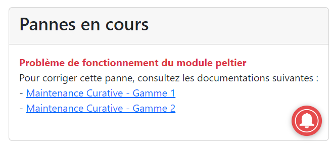

= Manuel d'utilisation de l'application
:toc:
:toc-title: Sommaire

Date : 20/01/2023 +
Client : Rémi Boulle +
Projet : Création d'une application web permettant de visualiser des données d'une tireuse à bière améliorée par l'ajout de capteurs + 

<<<

== 1. Description du Projet
=== a) Equipe

Étudiant.e.s +
- https://github.com/Fiujy[KERROUCHE Mohamed] : Développeur +
- https://github.com/GalateeM[MARCQ Galatée] : SCRUM Master +
- https://github.com/LeilaMartinet[MARTINET Leila] : Product Owner +
- https://github.com/caerroff[MASIN Thomas] : Développeur +
- https://github.com/hugomonte[MONTE Hugo] : Développeur

Professeur.e.s +
- https://github.com/rboulle[Rémi Boulle] +
- https://github.com/ependaries[Esther Pendaries]

=== b) Contexte du projet

La SAE 3.01 est une SAE inter-départements, réalisée en collaboration entre les étudiants de seconde année de BUT Génie Industriel et Maintenance et nous-mêmes, étudiants en deuxième années de BUT Informatique. Ces derniers ayant amélioré une tireuse à bière en lui intégrant des capteurs, ils ont besoin que nous leur développions une application permettant d’exploiter graphiquement les données ainsi récupérées, afin de gérer l’état et les pannes éventuelles de la machine.

=== c) Objectifs du projet

L'objectif de ce projet est la création d'un application web, de la documentation technique, utilisateur et un cahier de tests. +
Grâce à l'application, l'utilisateur doit pouvoir consulter les données de la tireuse en temps réel, mais également à l'historique des données sur une période donnée. L'application permettra également de consulter les pannes en cours, de pouvoir consulter la documentation pour dépanner la tireuse, et de recevoir des notifications concernant ses pannes soit par mail soit en notification push s'il s'y est abonné.

== 2. Déploiement du projet en local

Prérequis : +
- Installation de Docker sur votre ordinateur

=== a) Utilisation du docker

*Note d'usage :* nous utiliserons `docker compose` dans les exemples ci-dessous, mais dans les anciennes versions de Docker, il s'agit de `docker-compose` (un tiret au lieu de l'espace).

Ouvrir une invite de commande (cmd dans le menu démarrer). Se placer dans le dossier "Code" du projet, en utilisant la commande `cd <chemin>`. +
Une fois dans le bon répertoire, taper `docker compose up` (`docker compose up -d` si vous voulez détacher votre terminal du lancement), cela lancera les services.

La première fois que vous lancerez cette commande, cela prendra plus de temps, car il téléchargera les images. Les fois suivantes, cela sera bien plus rapide !

Pour arrêter les services, taper simplement `docker compose down` (à ne pas faire si vous voulez suivre les étapes suivantes).

=== b) Comment accéder aux services ?

Ayant lancé les services Docker, vous pouvez désormais accéder à Node-RED en tapant "localhost:8080" dans le navigateur de votre choix. +

Pour accéder au site en lui-même, il faut vous rendre sur `localhost:3000`, rien de plus n'est nécessaire, vous serez immédiatement en lien avec les services, s'ils ont été correctement installés précédemment.

== 3. Utiliser l'application

=== a) Structure générale du site

Lors de votre première visite sur lei site, une alerte vous demandera si vous souhaitez recevoir des notifications. Pour plus d'information, rendez-vous au paragraphe `Notifications push et par mail`. Vous pourrez modifier votre choix à tout moment.

Le site est structuré en trois pages : +

- La page principale (`http://localhost:3000` ou `http://localhost:3000/index.html`). Cette page permet de visualiser les différentes données en temps réel, en cliquant sur les différentes "cartes" disponibles à gauche. La page contient également au centre un graphique représentant l'historique de chaque type de données sur une période de 6 heures. Pour plus d'informations, rendez-vous aux paragraphes `Visualisation des données en temps réel`, `Historique des données`, et `Pannes en cours`. 

- La page Maintenance (`http://localhost:3000/maintenance.html`). Cette page permet de consulter la documentation concernant la tireuse à bière. Pour plus d'informations, rendez-vous au paragraphe `Consulter les données de documentation`. +

- La page Pannes (`http://localhost:3000/pannes.html`). Cette page permet de consulter l'historique des pannes. Pour plus d'informations, rendez-vous au paragraphe `Historique des pannes`.

Sur toutes les pages, le bouton tout à gauche permet d'accéder au repository github, c'est-à-dire l'endroit où est stocké le code source de cette application web. Le bouton tout à droite (forme d'enveloppe) permet d'accéder à un formulaire pour s'inscrire aux notifications, soit push soit par mail. Enfin, le bouton en bas à droite (forme de cloche) permet de s'inscrire ou de se désisncrire aux notifications push. Pour plus d'informations, rendez-vous au paragraphe `Notifications push et par mail`.

=== b) Visualisation des données en temps réel

La page principale du site (`http://localhost:3000` ou `http://localhost:3000/index.html`) est structurée en deux parties. A gauche, vous trouverez différentes cases permettant de retrouver les valeurs concernant la température ambiante et celle du fût, la quantité de remplissage du fût, la puissance et la consommation en CO2. 

Sur le reste de la page, des informations supplémentaires en fonction du type de données qui a été sélectionné sur les cases à gauche (par défaut, sur température). 

On retrouve en haut un historique sous forme de graphique (cf paragraphe suivant).

En dessous, la partie "Informations supplémentaires" comporte un affichage plus spécifique des informations mises à dispositions, avec un système de jauge dynamique ou logo évoluant en fonction de l'état de la donnée. L'état de l'appareil est également présent. Voici les différents états possibles, par ordre de priorité (si plusieurs conditions d'un état sont valides, alors l'état en cours sera le plus prioritaire) : +
- MQTT 2 déconnecté +
- Température élevée de la bière : si la température intérieure est supérieure à 7°C +
- Le fût est bientôt vide : si le taux de remplissage du fût est inférieur à 10% +
- Le fût est plein : si le taux de remplissage du fût est supérieur à 90% +
- Température idéale de la bière : si la température intérieur est comprise entre 2 et 7°C

On retrouve enfin en bas à droite, un historique des pannes en cours (cf paragraphe e)).

=== c) Historique des données

L'historique de chaque donnée (température intérieure, température extérieure, quantité du fût, puissance, consommation en CO2) est représentée sous forme de graphique. Pour changer de graphique, il vous suffit de cliquer sur une autre case présente à gauche. +
Les données sont récoltées sur une période de 6h. Des moyennes sont réalisées toutes les 50 valeurs, sachant que des données sont reçues toutes les 5 secondes. Vous pouvez passer la souris sur les points présents sur le graphique pour consulter une donnée avec plus de précision.

=== d) Consulter les fichiers de documentation

La page  Maintenance (`http://localhost:3000/maintenance.html`), permet de consulter les différentes documentations liées à la tireuse. Sur cette page, vous retrouverez sur la partie gauche une barre latérale, avec la liste des documents disponibles en PDF. On y retrouve 2 options, "Prévisualiser" et "Ouvrir". La prévisualisation remplace le document actuel sur la partie principale de la page et le titre juste au-dessus de celle-ci par le nom du document choisi. L'ouverture permet d'afficher dans un nouvel onglet le fichier PDF en lui-même, permettant de le télécharger ou de l'imprimer par exemple.

=== e) Pannes en cours

La page principale du site (`http://localhost:3000` ou `http://localhost:3000/index.html`), vous retrouverez les éventuelles pannes en cours en bas à droite. Si aucune panne n'est en cours, le message "Aucune panne en cours !" sera présent. Sinon, voici les différentes conditions qui permettent la détection d'une panne : +
- Capteur de température ambiante déconnecté : la température extérieure est inférieure à -120 +
- Capteur de température du fût déconnecté : la température intérieure est inférieure à -120 +
- Wattmètre déconnecté : la puissance vaut -10 +
- Puissance consommée trop importante : la puissance est supérieure à 75W
- MQTT 2 déconnecté : le MQTT 2 est déconnecté
- Problème de fonctionnement du module peltier :la température extérieure est inférieure à 30 et celle extérieure est supérieure à 10, depuis plus de 30min +

Certaines pannes ont des documentations liées. Vous verrez ainsi apparaître un lien cliquable en bleu, en voici un exemple : +
 +
En cliquant sur un des liens proposés, vous accéderez directement à la documentation dans la page Maintenance. Le bon document sera affiché en prévisualisation au milieu de la page.

=== f) Historique des pannes

Afin de pouvoir voir toutes les pannes, mêmes résolues, étant survenues au cours des 6 dernières heures, vous pouvez cliquer sur `Pannes` dans la barre de navigation ou vous rendre directement à `http://localhost:3000/pannes.html`. +
Vous y trouverez : +
- En haut à gauche, dans un encadré, le nombre total de pannes +
- (Si le nombre de pannes est supérieur à 0) En haut à gauche, en dessous du nombre total de pannes, un diagramme circulaire de la répartition du nombre de pannes +
- (Si le nombre de pannes est supérieur à 0) Au centre, une frise chronologique verticale reprenant toutes les pannes

=== g) Notifications push et par mail

Lors de votre première visite sur le site, une alerte vous demandera si vous souhaitez recevoir des notifications. Si vous acceptez, vous recevrez des notifications push en fonction de l'état de la tireuse. Si vous souhaitez modifier votre choix, vous pouvez cliquer sur l'icone en forme de cloche en bas à droite afin d'accepter ou de refuser les notifications. +
En cliquant sur le bouton en haut à droite en forme d'enveloppe, vous pouvez également vous inscrire aux notifications par mail, ou aux notifications push. Vous devez renseigner votre adresse mail si vous souhaitez les notifications par mail, et vous devez cocher la case des notifications push si vous souhaitez celles-ci. Pour fermer le formulaire sans enregistrer vos préférences, cliquez sur `Annuler`. +
En cliquant sur `Je m'inscris`, vous aurez une alerte vous confirmant pour quelle type de notification vous vous êtes inscrit : +
- Vous recevrez désormais des notifications push. +
- Vous recevrez désormais des notifications par mail. +
- Ou les deux messages si vous avez choisi les deux options. Si vous êtes déjà inscrit aux notifications push et que vous ne cochez pas la case, cela ne vous désinscrira pas. Vous pouvez renseigner autant d'adresses mail que vous souhaitez. Dans chaque mail que vous recevrez, vous aurez la possibilité de vous désinscrire.

Voici l'ensemble des notifications que vous pouvez recevoir : +
- Capteur de température ambiante déconnecté ! +
- Capteur de température du fût déconnecté ! +
- Wattmètre déconnecté ! +
- Puissance consommée trop importante ! +
- Le fût est bientôt vide, pensez à le recharger ! +
- MQTT 2 déconnecté ! +
- Problème de fonctionnement du module peltier +

Si plusieurs pannes ou état proviennent en même temps, vous ne recevrez qu'une seule notification.
